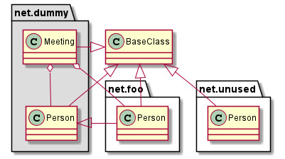
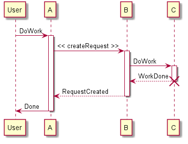

# Extended Docs

`\1 Internet Banking System\Single Page Application\Extended Docs`

* [Overview](/docs/README.md)
  * [1 Internet Banking System](/docs/1%20Internet%20Banking%20System/README.md)
    * [API Application](/docs/1%20Internet%20Banking%20System/API%20Application/README.md)
    * [Single Page Application](/docs/1%20Internet%20Banking%20System/Single%20Page%20Application/README.md)
      * [Dynamic Diagram](/docs/1%20Internet%20Banking%20System/Single%20Page%20Application/Dynamic%20Diagram/README.md)
      * [**Extended Docs**](/docs/1%20Internet%20Banking%20System/Single%20Page%20Application/Extended%20Docs/README.md)
  * [2 Deployment](/docs/2%20Deployment/README.md)

---

Multiple markdowns can be ordered using `<name>.1.md, <name>.2.md .. <name>.<n>.md`

Feel free to add any additional details necesary.