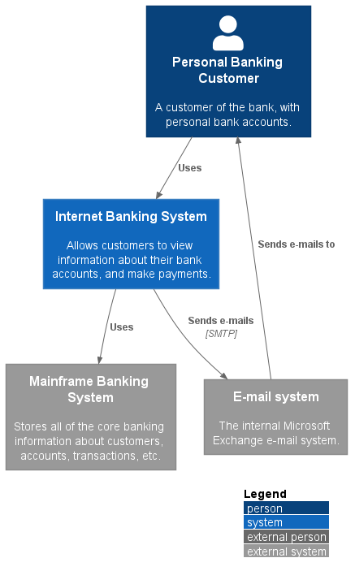

# Overview

* [**Overview**](/docs/README.md)
  * [1 Internet Banking System](/docs/1%20Internet%20Banking%20System/README.md)
    * [API Application](/docs/1%20Internet%20Banking%20System/API%20Application/README.md)
    * [Single Page Application](/docs/1%20Internet%20Banking%20System/Single%20Page%20Application/README.md)
      * [Dynamic Diagram](/docs/1%20Internet%20Banking%20System/Single%20Page%20Application/Dynamic%20Diagram/README.md)
      * [Extended Docs](/docs/1%20Internet%20Banking%20System/Single%20Page%20Application/Extended%20Docs/README.md)
  * [2 Deployment](/docs/2%20Deployment/README.md)

---

**Level 1: System Context diagram**

A System Context diagram is a good starting point for diagramming and documenting a software system, allowing you to step back and see the big picture. Draw a diagram showing your system as a box in the centre, surrounded by its users and the other systems that it interacts with.

Detail isn't important here as this is your zoomed out view showing a big picture of the system landscape. The focus should be on people (actors, roles, personas, etc) and software systems rather than technologies, protocols and other low-level details. It's the sort of diagram that you could show to non-technical people.

**Scope**: A single software system.

**Primary elements**: The software system in scope.
Supporting elements: People (e.g. users, actors, roles, or personas) and software systems (external dependencies) that are directly connected to the software system in scope. Typically these other software systems sit outside the scope or boundary of your own software system, and you don’t have responsibility or ownership of them.

**Intended audience**: Everybody, both technical and non-technical people, inside and outside of the software development team.